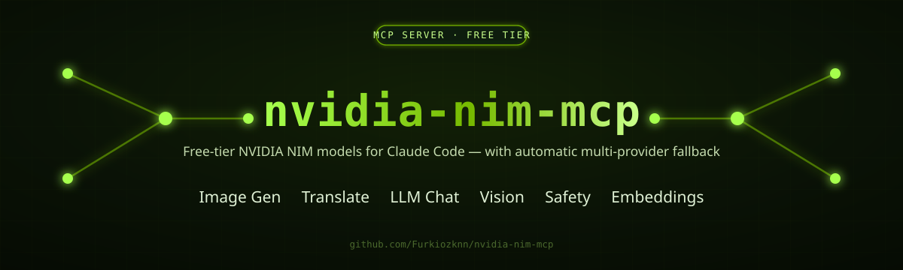
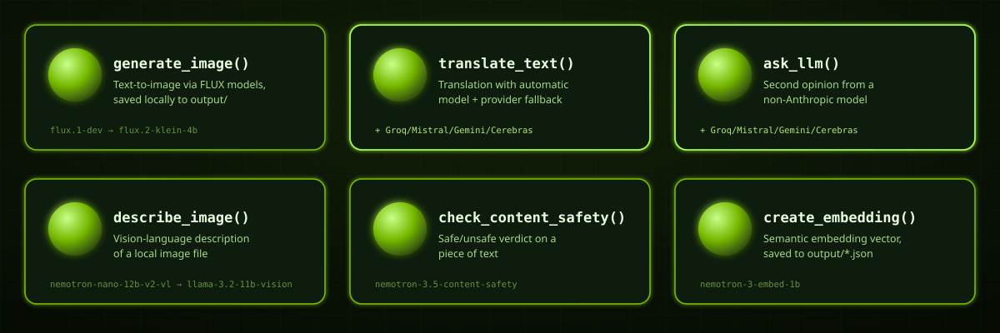
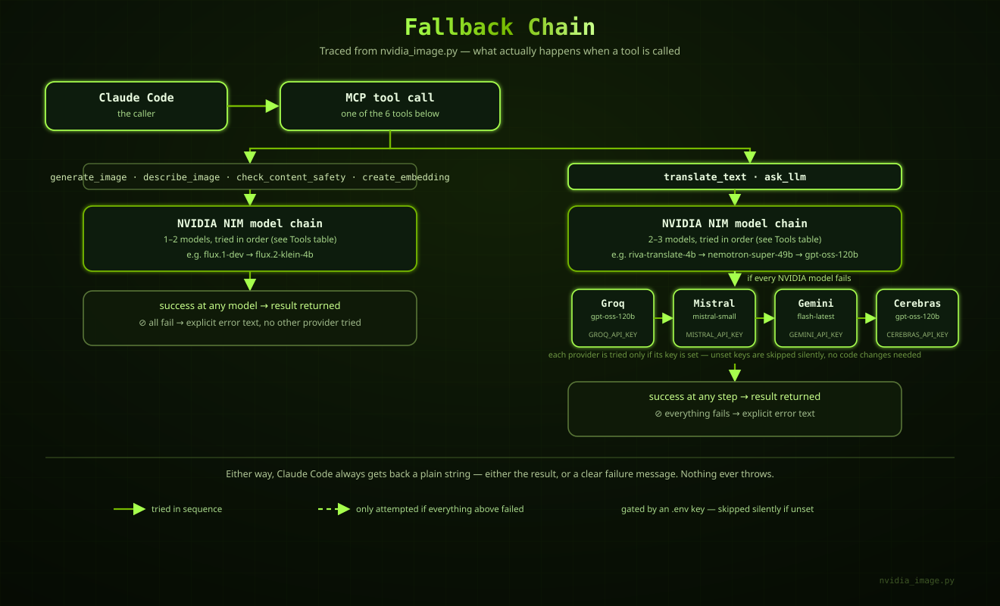

<div align="center">



[](LICENSE)
[](pyproject.toml)
[](https://modelcontextprotocol.io)
[](#-setup)

</div>

# nvidia-nim-mcp

An MCP ([Model Context Protocol](https://modelcontextprotocol.io)) server that plugs [NVIDIA NIM](https://build.nvidia.com/)'s free-tier models straight into Claude Code — image generation, translation, LLM chat, vision, content safety, embeddings, and a provider health check — behind seven small, consistent tools.

The idea is simple: **a model being slow, rate-limited, or quietly retired should never take a tool down.** Every capability tries more than one model, and two of them — translation and the "ask another LLM" tool — keep going past NVIDIA into whichever free-tier providers you've configured (Groq, Mistral, Gemini, Cerebras). The caller never has to know or care which model actually answered.

Zero cost. No credit card. Just an API key from [build.nvidia.com](https://build.nvidia.com/).

## Table of Contents

- [Tools](#-tools)
- [The fallback chain](#-the-fallback-chain)
- [Setup](#-setup)
- [Example usage](#-example-usage)
- [Output files](#-output-files)
- [Development](#-development)
- [Project layout](#-project-layout)
- [License](#-license)

## 🧰 Tools



Seven tools. Six are backed by their own model chain; the seventh checks the health of every model the other six actually use. Every generation tool now has at least one fallback beyond NVIDIA — see [The fallback chain](#-the-fallback-chain) for exactly how each one is shaped.

| Tool | What it does | NVIDIA model chain (in order) | Fallback beyond NVIDIA |
|---|---|---|---|
| 🖼️ `generate_image` | Text-to-image via FLUX, saved to `output/` | `flux.1-dev` → `flux.2-klein-4b` | Pollinations.ai (free, keyless) |
| 🌐 `translate_text` | Translate text into any target language | `riva-translate-4b-instruct-v2` → `llama-3.3-nemotron-super-49b-v1.5` → `gpt-oss-120b` | Groq/Mistral/Gemini/Cerebras, whichever configured |
| 💬 `ask_llm` | Ask a non-Anthropic model for a second opinion | `llama-3.3-nemotron-super-49b-v1.5` → `gpt-oss-120b` | Groq/Mistral/Gemini/Cerebras, whichever configured |
| 👁️ `describe_image` | Vision-language description of a local image | `nemotron-nano-12b-v2-vl` → `llama-3.2-11b-vision-instruct` | Groq/Mistral/Gemini vision models, whichever configured |
| 🛡️ `check_content_safety` | Safe/unsafe verdict on a piece of text | `nemotron-3.5-content-safety` | Best-effort classification prompt via Groq/Mistral/Gemini/Cerebras |
| 🔗 `create_embedding` | Semantic embedding vector, saved to `output/` | `nemotron-3-embed-1b` | Local sentence-transformers (`local-embeddings` extra, opt-in) |
| 🩺 `check_provider_health` | Liveness probe for every model above, without generating real content | every model used by the other six, concurrently | checks every fallback tier too |

Every model in these chains was confirmed working with a real request before being wired in — see the comments at the top of `nvidia_image.py` for the verification notes (including two models that were removed after NVIDIA retired them outright, HTTP 410). `check_provider_health` exists precisely because that kind of silent retirement keeps happening — run it to see what's actually alive right now instead of finding out mid-request.

## 🔄 The fallback chain

This is the one feature worth understanding properly, because it's not the same for every tool.



**In short:**

1. **All six generation tools** try their NVIDIA models first, in the order shown in the table above. The first one that answers wins. (`check_provider_health` is different — it probes every model instead of stopping at the first success; see its row above.)
2. **`translate_text` and `ask_llm`** keep going if every NVIDIA model in their chain fails. They fall through to whichever of these you've configured, in this fixed order:

   | Order | Provider | Model | Gate |
   |---|---|---|---|
   | 1 | Groq | `groq/openai/gpt-oss-120b` | `GROQ_API_KEY` |
   | 2 | Mistral | `mistral/mistral-small-latest` | `MISTRAL_API_KEY` |
   | 3 | Gemini | `gemini/gemini-flash-latest` | `GEMINI_API_KEY` |
   | 4 | Cerebras | `cerebras/gpt-oss-120b` | `CEREBRAS_API_KEY` |

   Any provider whose key is missing from `.env` is skipped silently — no error, no code change needed. Drop a key in and it joins the chain on the next call.
3. **`generate_image`** also has one fallback tier, but a different one: if both `flux.1-dev` and `flux.2-klein-4b` fail, it drops to [Pollinations.ai](https://pollinations.ai/) — free, keyless, no `.env` entry required. It's a lower-quality tier than either NVIDIA model, so it's deliberately last-resort rather than tried first for speed.
4. **`describe_image`, `check_content_safety`, and `create_embedding` stay NVIDIA-only.** If every model in their chain fails, you get back a clear error string listing what was tried — nothing throws, and nothing silently falls through to another provider.

Why the split? Image generation has one free, keyless fallback (Pollinations) worth using since it costs nothing to try; vision, safety, and embeddings depend on NVIDIA-specific model shapes with no equivalent free tier elsewhere yet; chat-style text generation has the widest safety net since more free-tier LLM providers exist. Nothing stops the other tools from growing one later.

## ⚙️ Setup

**1. Install dependencies** (this project uses [`uv`](https://docs.astral.sh/uv/), not bare pip/venv):

```bash
uv sync
```

**2. Create a `.env` file** in the project root. `.env.example` shows the shape:

```bash
# Required — get a free key at https://build.nvidia.com/
NVIDIA_API_KEY=your-key-here

# Optional — extend the fallback chain. Each is skipped silently if unset.
GROQ_API_KEY=
MISTRAL_API_KEY=
GEMINI_API_KEY=
CEREBRAS_API_KEY=
```

Only `NVIDIA_API_KEY` is required. Get one for free at [build.nvidia.com](https://build.nvidia.com/) — no credit card. The four extras are entirely optional and only affect `translate_text` and `ask_llm`; add whichever free-tier keys you already have to widen their fallback chain.

| Provider | Get a free key |
|---|---|
| NVIDIA NIM (required) | [build.nvidia.com](https://build.nvidia.com/) |
| Groq | [console.groq.com/keys](https://console.groq.com/keys) |
| Mistral | [console.mistral.ai/api-keys](https://console.mistral.ai/api-keys) |
| Gemini | [aistudio.google.com/apikey](https://aistudio.google.com/apikey) |

**3. Register it as an MCP server** with Claude Code (project or user scope):

```bash
claude mcp add --transport stdio nvidia-nim -- uv run --project /path/to/this/repo nvidia_image.py
```

That's it — `nvidia-nim`'s seven tools are now available to Claude Code in any session where the server is registered.

## ▶️ Example usage

Once registered, just ask Claude Code in plain language — it picks the right tool on its own:

```
"Generate an image of a cyberpunk cat riding a motorcycle through Istanbul at night"
→ generate_image  → saved to output/flux.1-dev_20260830_153000.jpg

"Translate this changelog entry to Turkish"
→ translate_text  → tries riva-translate → nemotron → gpt-oss → (Groq/Mistral/Gemini/Cerebras if configured)

"Ask another model what it thinks of this API design, I want a second opinion"
→ ask_llm         → tries nemotron-super-49b → gpt-oss-120b → your configured extras

"What's in this screenshot at C:\Users\me\Desktop\error.png?"
→ describe_image  → nemotron-nano-12b-v2-vl (or the llama vision fallback)

"Is this user comment appropriate to publish?"
→ check_content_safety → nemotron-3.5-content-safety verdict

"Create an embedding for this paragraph so I can search similar ones later"
→ create_embedding → saved to output/embedding_20260830_153000.json

"Which of the NVIDIA models are actually working right now?"
→ check_provider_health → per-model OK/FAIL report across all 6 tools' chains
```

## 📁 Output files

`generate_image` and `create_embedding` write to `output/` in the project root (created automatically) — images as timestamped `.jpg` files named after the model that produced them, embeddings as timestamped `.json` files containing the source text, model, and vector. Every other tool returns its result directly as text, with the model that answered noted at the end.

## 🛠 Development

```bash
uv sync --group dev
uv run pytest
```

The suite (`tests/`) mocks every HTTP/litellm call — no `NVIDIA_API_KEY` or real network access needed to run it. It covers the fallback-chain ordering, the cross-provider gating logic, the `.env`-not-set guard on each tool, and `check_provider_health`'s per-model OK/FAIL reporting (including that one dead model never hides the others' status). CI (`.github/workflows/ci.yml`) runs the same command on every push/PR.

## 🗂 Project layout

```
nvidia-nim-mcp/
├── nvidia_image.py     # the MCP server — all 7 tools live here
├── tests/               # pytest suite, fully mocked, no API key needed
├── pyproject.toml      # uv project + dependencies (httpx, litellm, mcp)
├── .env.example        # copy to .env and fill in your keys
├── .github/workflows/  # CI: uv sync --group dev && uv run pytest
├── output/             # generated images + embeddings land here
└── assets/             # banner, fallback diagram, tool grid (this README's visuals)
```

## 📄 License

MIT — see [LICENSE](LICENSE).

---

<div align="center">
<sub>Bir hobi projesi olarak başladı, hâlâ öyle. NVIDIA'nın ücretsiz katmanını Claude Code'a bağlayan küçük ama işini yapan bir köprü. 🟢</sub>
</div>
